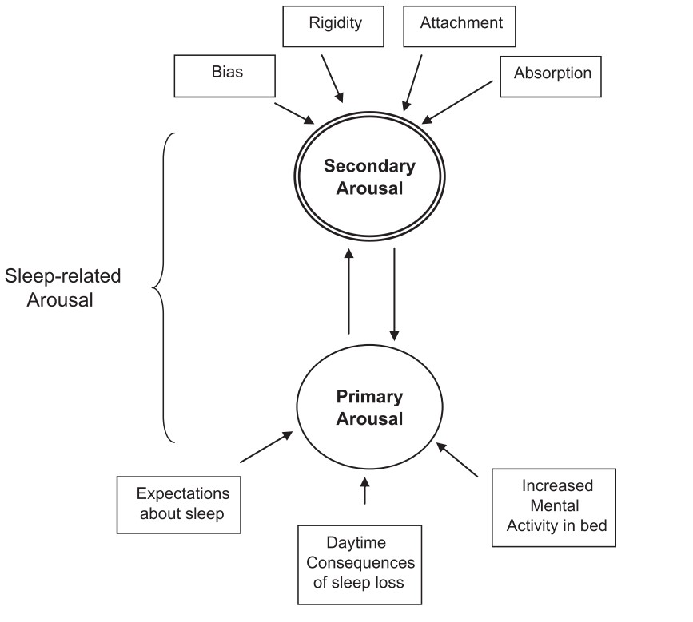

```{r setup, include=FALSE}
options(htmltools.dir.version = FALSE)
knitr::opts_chunk$set(
  fig.width=9, fig.height=3.5, fig.retina=3,
  out.width = "100%",
  cache = FALSE,
  echo = TRUE,
  message = FALSE, 
  warning = FALSE,
  hiline = TRUE
)
```

```{r xaringan-themer, include=FALSE, warning=FALSE}
library(xaringanthemer)
library(xaringanExtra)
style_duo_accent(
  title_slide_background_color ="#FFFFFF",
  title_slide_text_color = "#024F84",
  primary_color = "#024F84",
  secondary_color = "#FF961C",
  inverse_header_color = "#FFFFFF",
  text_color = "#515151",
  text_font_size = "1.2rem"
)
```

```{r xaringan-logo, echo=FALSE}
xaringanExtra::use_logo(
  image_url = c("img/fapesp-ipq.png"),
  width = "365px",
  height = "79px",
  position = css_position(top = "1em", right = "1em"),
  exclude_class = c("my-title", "inverse", "hide_logo")
)
```

## Introduction

Insomnia sufferers are a group characterized for frequent complaints about quality and quantity of sleep, difficulties in initiating and maintaining sleep and early-morning awakenings with inability to return to sleep.

- Psychological disorders like anxiety and depression are known to co-occur with symptoms of insomnia and are possible aggravating factors for sleep problems

- Evidence suggests that the relationship between anxiety and depression with insomnia are bidirectional

- Excess of negatively toned cognitive activity about sleep may maximize worries and ruminative thoughts increasing arousal

- An anxiety state shifts attention to sleep-related threats

---

## Introduction
### Cognitive-behavioral model of insomnia

- Arousal, cognitions, behaviors, and perceived consequences play an important role in maintaining insomnia symptoms

- People with insomnia tend to hold dysfunctional beliefs and maladaptative behaviors in response to sleep problems

- These beliefs and attitudes about sleep are proxies for the cognitive arousal that feeds the cycle of insomnia

---
class: center, middle

```{r echo=FALSE, out.width = "60%", fig.cap = "Two-level model of sleep-related arousal (Ong et al. 2012)", fig.align='left'}

```

---
class: middle, left

## Hypotesis

People with insomnia tend to be rigid in their thinking and behaviors. Greater levels of psychological flexibility in thoughts and behaviours contributes to decreases in secondary arousal. 

- <b>Hypotesis</b>: Psychological flexibility moderates the relationship  between dysfunctional beliefs about sleep and insomnia severity.

---

## Methods

- **Participants**: 457 participants enrolled for a behavioral treatment for insomnia.

- **Measures**: ISI, DBAS-16, AAQ-II, HADS-A, HADS-D

- **Statistical Analysis**: Multiple linear regression with the form:

$$ 
ISI = Age + Sex + HADSA + HADS-D + DBAS + AAQ-II + DBAS*AAQ-II 
$$

---
class: center, middle

# Thanks!

Slides created via the R packages:

[**xaringan**](https://github.com/yihui/xaringan)<br>
[gadenbuie/xaringanthemer](https://github.com/gadenbuie/xaringanthemer)

The chakra comes from [remark.js](https://remarkjs.com), [**knitr**](http://yihui.name/knitr), and [R Markdown](https://rmarkdown.rstudio.com).
