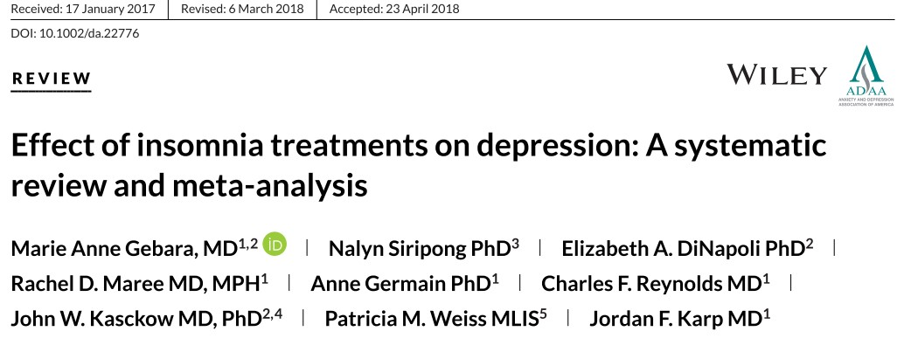

```{r setup, include=FALSE}
options(htmltools.dir.version = FALSE)
knitr::opts_chunk$set(
  fig.width=9, fig.height=3.5, fig.retina=3,
  out.width = "100%",
  cache = FALSE,
  echo = TRUE,
  message = FALSE, 
  warning = FALSE,
  hiline = TRUE
)
```

```{r xaringan-themer, include=FALSE, warning=FALSE}
library(xaringanthemer)
library(xaringanExtra)
style_duo_accent(
  title_slide_background_color ="#FFFFFF",
  title_slide_text_color = "#024F84",
  primary_color = "#024F84",
  secondary_color = "#FF961C",
  inverse_header_color = "#FFFFFF",
  text_color = "#515151",
  text_font_size = "1.2rem"
)
```

# Justificativa

Insônia e depressão são transtornos que co-ocorrem com frequência.

A **Terapia Cognitivo Comportamental (TCC)** tem se mostrado um tratamento efetivo tanto para insônia quanto para depressão.

Para pacientes com comorbidade dos dois transtornos o tratamento da insônia leva a melhora nos níveis de depressão, mas intervenções com foco apenas na depressão podem não resultar em remissão da insônia.

Evidências recentes sugerem que para pacientes com transtorno de insônia e transtorno depressivo maior, é essencial que o plano de tratamento foque nos problemas de sono, além da depressão.

No entanto, ainda é necessário comparar e quantificar os resultados clínicos de pacientes tratados com uma ou outra forma de terapia.
---
name: objetivos

# Objetivos
.bigger-text[
- **Objetivo Primário**: Comparar a resposta de pacientes diagnosticados com insônia e depressão ao tratamento com TCC combinada para os dois transtornos à TCC apenas para depressão.

- **Hipótese**: Espera-se que participantes tratados com a terapia para insônia e depressão tenham melhora mais expressiva e duradoura nos sintomas de insônia e depressão do que o grupo atendido com protocolo único para depressão.

]
---

# Método

## 1. Desenho do estudo 

O estudo será realizado como um **ensaio clínico randomizado-controlado paralelo**. Os participantes que atenderem aos critérios de inclusão serão randomizados entre grupos TTC para depressão (TCC-D), TCC para depressão e insônia (TCC-DI).

Os resultados serão acessados no pós-tratamento e no seguimento de seis meses.

Os participantes serão informados quanto aos objetivos e resultados da pesquisa. Deverão assinar o Termo de Consentimento Livre e Esclarecido, que informará sobre os procedimentos, riscos, benefícios, garantias e liberdades.

---
## 2. Local e participantes

O estudo será realizado no Instituto de Psiquiatria do Hospital das Clínicas da Faculdade de Medicina da Universidade de São Paulo. O recrutamento dos participantes será feito por meio de divulgação na mídia.

.left-column2[
### Critérios de inclusão
a) Adultos maiores de 18 anos;

b) Diagnóstico de insônia de acordo com os critérios da Classificação Internacional de Transtornos do Sono (ICSD) e do Manual Diagnóstico e Estatístico de Transtornos Mentais (DSM-5);

c) Diagnóstico de Transtorno depressivo maior, segundo critérios do DSM-5;

d) Conseguir ler e escrever em português sem dificuldades
]

.right-column2[
### Critérios de exclusão
a) Comorbidades clínicas ou psiquiátricas;

b) Uso constante de drogas ilícitas e álcool;

c) Estar sob tratamento para depressão;

d) Estar sob tratamento para insônia;

e) Trabalhadores noturnos;

f) Indisponibilidade de comparecer às sessões de grupo
]
---
## 3. Tamanho da amostra

O cálculo amostral será realizado considerando encontrar um tamanho de efeito padronizado de 0.66, para depressão subclínica, conforme encontrado no estudo de meta-análise de Gebara et al. (2018).



---
## 4. Variáveis de exposição, desfecho e confusão

**Variáveis de exposição**

1. TCC com protocolo para insônia e depressão

2. TCC para depressão

**Variáveis de desfecho**

Os participantes serão avaliados segundo a severidade dos sintomas de insônia e depressão.

**Variáveis de confusão**

.left-column1[
- Uso de medicamentos;
- Intercorrências cotidianas;
- Questões sociodemográficas
]

.right-column1[
- Sexo biológico;
- Idade;
- Presença de outros transtornos clínicos ou psiquiátricos
]
---
## 5. Avaliações
.bigger-text[
- Questionário de coleta de informações sociodemográficas no ato de inscrição para a pesquisa

- Os desfechos primários serão avaliados por meio de escalas padronizadas de auto-relato:
  - **Insônia**: Índice de Gravidade da Insônia (IGI) e diário de sono
  - **Depressão**: Escala Hospitalar para Ansiedade e Depressão (HADS)
]
---
## 6. Procedimentos

O recrutamento será realizado na comunidade geral por meio de divulgação na mídia e no HC-FMUSP.

A triagem inicial será feita por meio de formulário eletrônico na plataforma web REDCap.

Os participantes que atenderem aos critérios prévios de inclusão serão avaliados por médicos através de entrevista clínica estruturada para atestar eligibilidade para a pesquisa.

A randomização dos participantes da pesquisa aos grupos de intervenção será feita com auxílio do software REDCap, conduzida por uma pessoa independente do estudo. Este procedimento também irá garantir o cegamento da sequência de randomização.

---
## 6. Procedimentos

Os participantes serão instruídos a completar via REDCap os instrumentos de autoavaliação na fase de **linha de base** (pré-tratamento), uma semana **após o tratamento** e **seis meses** após a intervenção. O diário de sono será preenchido diariamente ao longo da duração da pesquisa.

Os grupos receberão o tratamento em oito sessões semanais realizadas em grupos, com duração de 90 a 120 minutos.

Os tratamentos para insônia e depressão serão ministrados por terapeutas cognitivo-comportamentais certificados, seguindo protocolos específicos para a intervenção terapêutica. 

Os terapeutas se alternarão no manejo dos tratamentos.
---
## 7. Proposta de análise dos dados
.bigger-text[

Os grupos serão comparados em relação às variáveis relativas às avaliações de insônia, padrão de sono e depressão.

Modelos mistos generalizados serão empregados para os testes de significância estatística, considerando intenção de tratamento.

O modelo inclui os fatores **Grupo** (TCC-I e TCC-DI) e **Tempo** (pré-tratamento, pós-tratamento e seguimento).
]


|  |Pré-intervenção|Pós-intervenção|Followup|
|:-:|:--------------:|:--------------:|:-------:|
|TCC-I |`r emo::ji("memo")`|`r emo::ji("memo")`| `r emo::ji("memo")`|
|TCC-DI|`r emo::ji("memo")`|`r emo::ji("memo")`|`r emo::ji("memo")`|
---
## 8. Forças e limitações

O delineamento permite reduzir a influência de vieses de seleção e de variáveis de confusão, fornecendo boas evidências a respeito da **relação causal** entre exposição e desfecho.

As avaliações de seguimento permitem analisar a **estabilidade temporal** dos resultados da intervenção.

Trata-se de um estudo de **eficácia**. Permite compreender os mecanismos de ação, mas não é possível avaliar os resultados em condições de rotina encontradas na prática clínica.

Terapeutas não estão cegos quanto ao tipo de intervenção que cada grupo irá receber.

Resultados limitados a participantes voluntários caracterizados pelos critérios de inclusão.

As variáveis de desfecho serão avaliadas apenas com instrumentos subjetivos.
---
# Referências

Blom, K., Jernelöv, S., Kraepelien, M., Bergdahl, M. O., Jungmarker, K., Ankartjärn, L., Lindefors, N., & Kaldo, V. (2015). Internet treatment addressing either insomnia or depression, for patients with both diagnoses: A randomized trial. *Sleep, 38*(2), 267–277. https://doi.org/10.5665/sleep.4412

Clarke, G., McGlinchey, E. L., Hein, K., Gullion, C. M., Dickerson, J. F., Leo, M. C., & Harvey, A. G. (2015). Cognitive-behavioral treatment of insomnia and depression in adolescents: A pilot randomized trial. *Behaviour Research and Therapy, 69*, 111–118. https://doi.org/10.1016/j.brat.2015.04.009 

Gebara, M. A., Siripong, N., DiNapoli, E. A., Maree, R. D., Germain, A., Reynolds, C. F., Kasckow, J. W., Weiss, P. M., & Karp, J. F. (2018). Effect of insomnia treatments on depression: A systematic review and meta-analysis. *Depression and Anxiety, 35*(8), 717–731. https://doi.org/10.1002/da.22776 