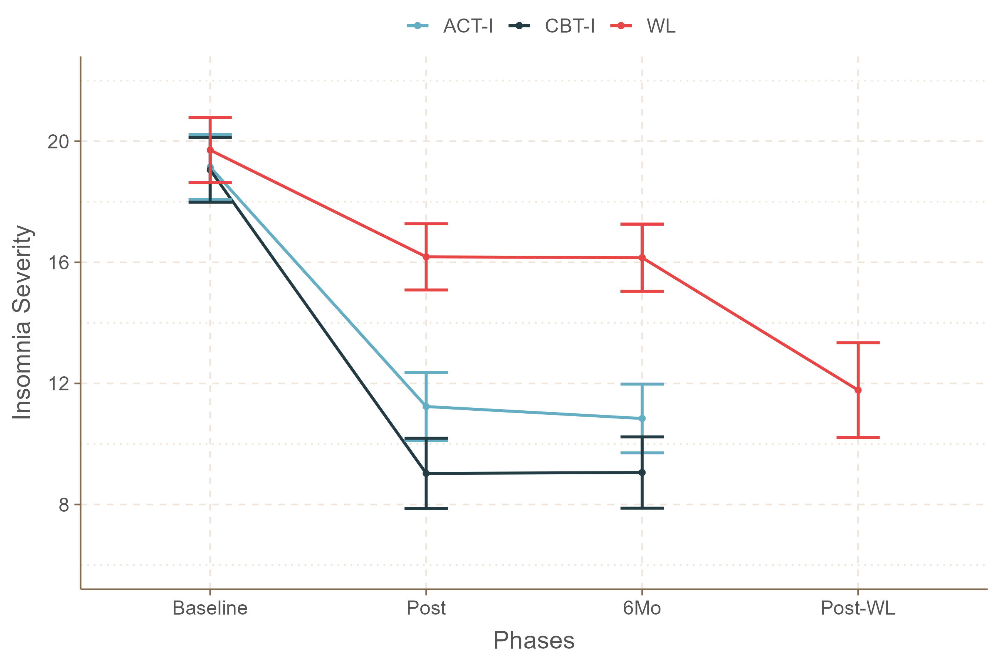
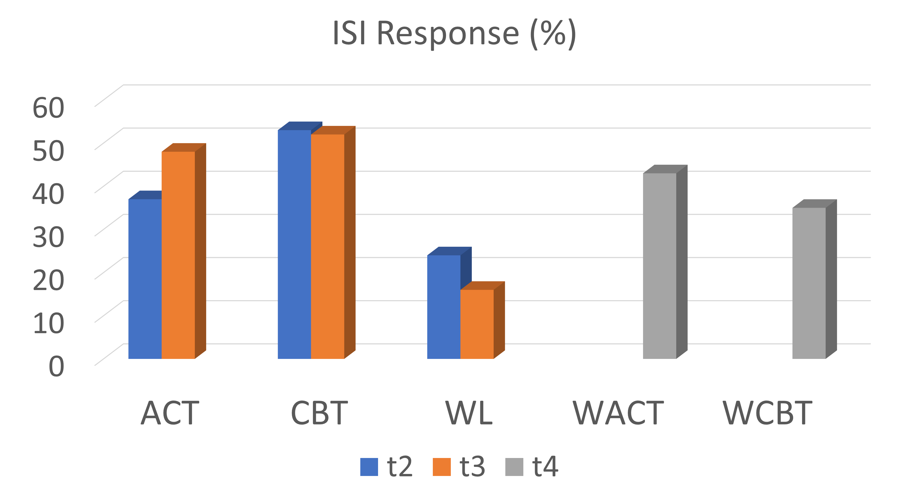

```{r, include=FALSE}
knitr::opts_chunk$set(results = 'asis',
                      echo = FALSE,
                      warning = FALSE,
                      tidy = FALSE,
                      message = FALSE,
                      fig.align = 'center',
                      out.width = "100%")
options(knitr.table.format = "html") 
```

```{r myplot, include=FALSE}
svg('myplot.svg')
plot(iris$Sepal.Length, iris$Sepal.Width)
dev.off()
```

# Introduction

- Not all individuals respond to CBT, and many do not maintain their gains over the long term. ACT has a growing empirical base in the treatment of insomnia complaints among adults, aiming to increase their psychological flexibility, not concentrating exclusively on symptom control. 

- This study evaluated the effectiveness of ACT-based protocol for insomnia in adults compared to CBT for insomnia. 

# Methods

227 adults (173 women; $M_{age}$ = 40.7 years) with insomnia were randomized to 6 weekly group sessions consisting of ACT-I (*n*=76), CBT-I (*n*=76), or Waitlist (WL; *n*=75). To measure the success of the treatment, we used binary variables to show if the participant achieved response (ISI$_{post}$ − ISI$_{pre}$ $\ge$  8), remission at posttreatment (ISI $\lt$ 8), and remission maintenance at 6-month follow-up (ISI $\lt$ 8).

# Results

Both treatments significantly reduced insomnia severity with large effect sizes in the posttreatment phase. These results were maintained in the follow-up period. CBT was superior to ACT in reducing ISI at posttreatment and follow-up, with a small effect size.


# Discussion

ACT alone, without stimulus control and sleep restriction techniques, is also effective for insomnia, being a viable option for those who have difficulties adhering to behavioral techniques. ACT targets psychological processes, which may take longer to modify, but once modified, the changes are sustained without further therapist guidance.

```{r, echo=FALSE, out.width="80%", fig.cap="Flow diagram of participants through each stage of the study."}
knitr::include_graphics("img/fluxograma.png")
```

```{r, echo=FALSE, out.width="80%", fig.cap="ISI scores in three groups and protocol phases."}

```

```{r, echo=FALSE, out.width="80%", fig.cap="Treatment response rates."}

```

```{r eval=FALSE, include=FALSE}
knitr::kable(
  iris[1:8,1:5], format = "html",
  caption = "A table made with the **knitr::kable** function.",
  align = "c", col.names = c("Sepal <br> Length",
                             "Sepal <br> Width",
                             "Petal <br> Length",
                             "Petal <br> Width",
                             "Species"),
  escape = FALSE)
```


