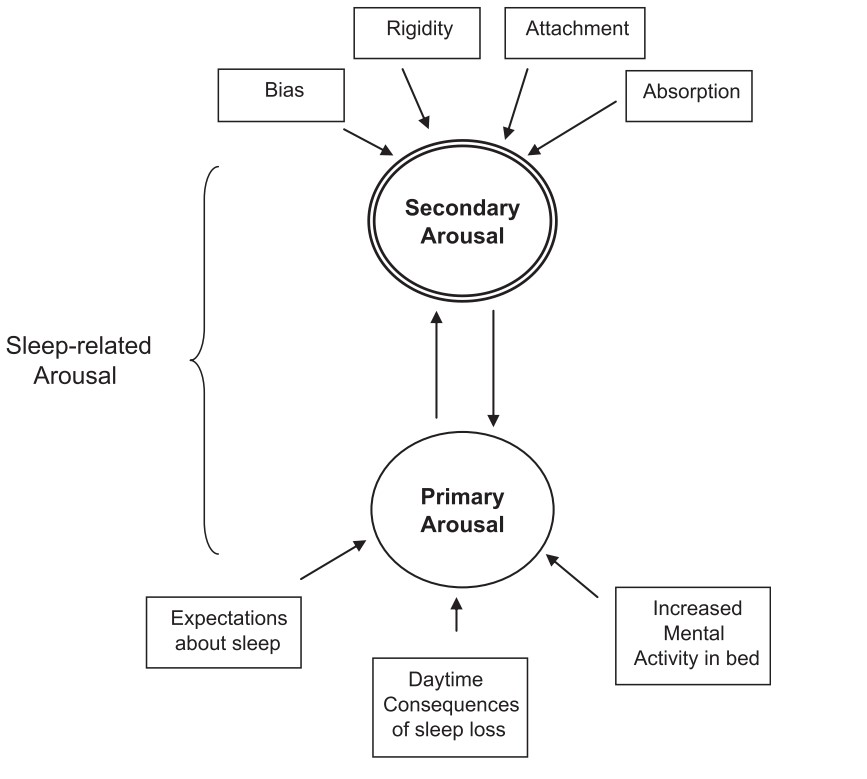
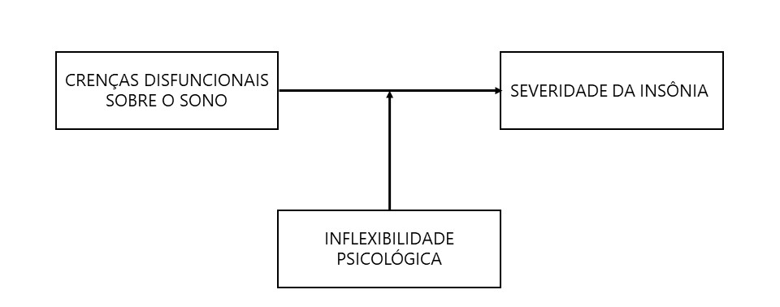
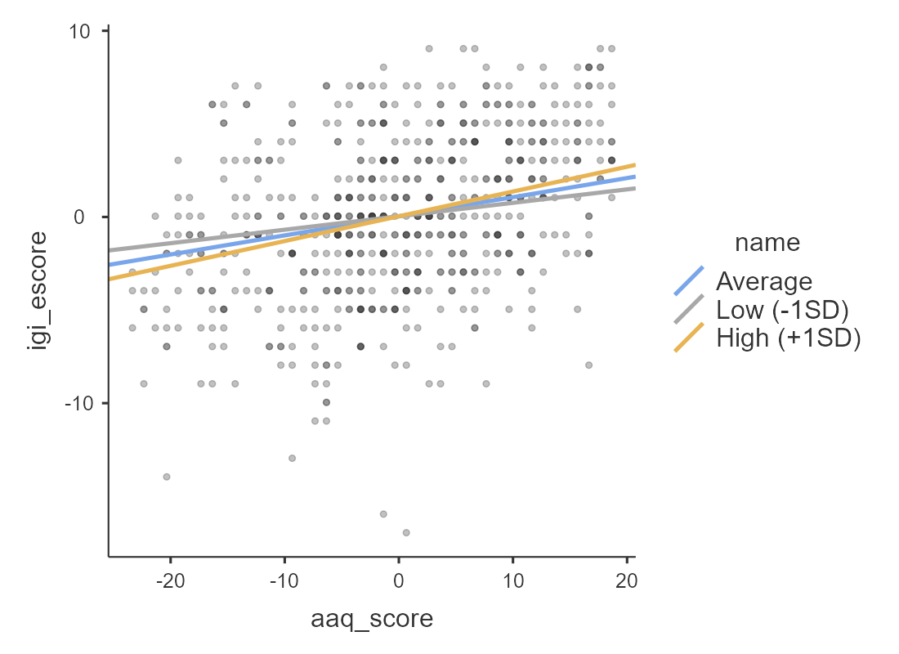

```{r setup, include=FALSE}
options(htmltools.dir.version = FALSE)
knitr::opts_chunk$set(
  fig.width=9, fig.height=3.5, fig.retina=3,
  out.width = "100%",
  cache = FALSE,
  echo = TRUE,
  message = FALSE, 
  warning = FALSE,
  hiline = TRUE
)
```

```{r xaringan-themer, include=FALSE, warning=FALSE}
library(xaringanthemer)
library(xaringanExtra)
library(dplyr)
library(ggplot2)

style_duo_accent(
  title_slide_background_color ="#FFFFFF",
  title_slide_text_color = "#024F84",
  primary_color = "#024F84",
  secondary_color = "#FF961C",
  inverse_header_color = "#FFFFFF",
  text_color = "#515151",
  text_font_size = "1.2rem",
  table_row_even_background_color = "#D6EAF8"# "#a1c7cf",
)
```

```{r xaringan-logo, echo=FALSE}
xaringanExtra::use_logo(
  image_url = c("img/fapesp-ipq.png"),
  width = "365px",
  height = "79px",
  position = css_position(top = "1em", right = "1em"),
  exclude_class = c("my-title", "inverse", "hide_logo")
)
```

```{r xaringan-scribble, echo=FALSE}
xaringanExtra::use_scribble()
```

```{r database , include=FALSE}
dados <- readr::read_csv("G:/Documentos/ProjetosR/ASONO/act_insonia/dados/base_arrumada_1409.csv")
```


## Introdução

A insônia é definida como um transtorno caracterizado predominantemente por insatisfação na qualidade e quantidade do sono, bem como por dificuldades na iniciação e manutenção do sono e incapacidade de voltar a dormir ao despertar em horário anterior ao habitual.

Transtornos como ansiedade e depressão frequentemente co-ocorrem com sintomas de insônia e se apresentam como possíveis agravantes de problemas de sono.

Há evidências de que o relacionamento entre ansiedade e depressão com a insônia é bidirecional.

O excesso de atividade cognitiva negativa sobre o sono pode maximizar preocupações. Pensamentos ruminativos podem aumentar a excitação e um estado de ansiedade desloca a atenção para as ameaças ao sono.

---

## Introdução
### O modelo cognitivo-comportamental da insônia (Morin, 1993)

Excitação, cognições, comportamentos e consequências percebidas desempenham um papel importante na manutenção dos sintomas de insônia.

Pessoas com insônia tendem a ter crenças disfuncionais e comportamentos desadaptativos em resposta aos problemas de sono.

Estas crenças e atitudes sobre o sono são gatilhos para excitação cognitiva que alimenta o ciclo da insônia.

---
## Introdução
### O modelo meta-cognitivo da insônia (Ong, Ulmer & Amber, 2012)

O modelo metacognitivo da insônia define a atividade cognitiva relacionada com a dificuldade de dormir como excitação primária. 

A forma como o sujeito interpreta e se relaciona com estes pensamentos se configura como a excitação secundária.

Sem a flexibilidade para gerar pensamentos alternativos aos desfuncionais, a insônia é perpetuada por meio da excitação secundária.

Como os processos primários e secundários se influenciam mutualmente, o conteúdo dos pensamentos desadaptativos sobre o sono pode impactar mais fortemente a manutenção da insônia se houver um apego rígido a eles.

---
class: center, middle

```{r echo=FALSE, out.width = "60%", fig.cap = "Two-level model of sleep-related arousal (Ong, Ulmer & Amber, 2012)", fig.align='left'}

```

---
## Objetivo

Investigar se a inflexibilidade psicológica modera o relacionamento entre crenças disfuncionais sobre o sono e a severidade da insônia.

```{r moderacao, echo=FALSE, out.width="80%", fig.align='center'}



```

---

## Método

**Participantes**: `r nrow(dados)` participantes com queixas de insônia, entre `r floor(min(pull(dados, idade)))` e `r ceiling(max(pull(dados, idade)))` anos, inscritos para um tratamento comportamental para insônia.

**Instrumentos**: Questionários de auto relato completados de forma online, incluindo

  - Formulário de identificação e informações pessoais;  
  - Escala Hospitalar de Ansiedade e Depressão (HADS);
  - Índice de Gravidade da Insônia (IGI);
  - Crenças e Atitudes Disfuncionais sobre o Sono (DBAS-16);
  - Acceptance and Action Questionnaire-II (AAQ-II)

**Análise estatística**: Um modelo de regressão linear múltipla foi ajustado para predizer os escores do IGI com idade, sexo, HADS-A, HADS-D, DBAS-16 e AAQII.

$$ 
IGI \sim Idade + Sexo + HADSA + HADSD + DBAS\times AAQII 
$$

---

## Resultados

```{r renda, include=FALSE}
dados_renda <- dados |> 
  pull(renda)

dados_etnia <- dados |> 
  filter(!is.na(etnia)) |> 
  count(etnia) |> 
  mutate(p = n/sum(n))

dados_escolaridade <- dados |> 
  count(escolaridade) |> 
  mutate(p = n/sum(n))

dados_med <- dados |> 
  count(medicacao_semana) |> 
  mutate(p = n/sum(n))

dados_regiao <- dados |> 
  count(regiao) |> 
  mutate(p = n/sum(n))

```


A média de idade dos participantes foi de `r round(mean(pull(dados, idade)), 1)` $\pm$ `r round(sd(pull(dados, idade)), 1)` anos. Dos `r nrow(dados)` participantes, `r sum(pull(dados, sexo) == "F")` são do sexo feminino. A mediana da renda familiar mensal por participante foi de R$ `r median(dados_renda, na.rm = TRUE)`,00. 

Em relação a etnia, `r round(pull(select(filter(dados_etnia, etnia == 1), p)),3)*100`% se declararam brancos, `r round(sum(pull(select(filter(dados_etnia, etnia == 2 | etnia == 3), p))),3)*100`% pretos ou pardos, `r round(pull(select(filter(dados_etnia, etnia == 4), p)),3)*100`% amarelos e `r round(pull(select(filter(dados_etnia, etnia == 5), p)),3)*100`% indígenas.

Participantes com ensino superior completo compuseram `r round(pull(select(filter(dados_escolaridade, escolaridade == 9), p)),3)*100`% da amostra.

`r round(sum(pull(select(filter(dados_med, medicacao_semana > 0 &  medicacao_semana <= 7), p))),3)*100`% dos participantes afirmou fazer uso de medicação para dormir ao menos uma vez na semana, enquanto `r round(pull(select(filter(dados_med, medicacao_semana == 7), p)),3)*100`% relataram usar remédios para dormir todos os dias.

A maior parte dos participantes são residentes da Região Sudeste (`r round(pull(select(filter(dados_regiao, regiao == "Região Sudeste"), p)),3)*100`%).

---

## Resultados

```{r dados_mapa, include=FALSE}

estados <- geobr::read_state()

para_mapa <- dados %>% 
  select(estado, regiao) %>% 
  mutate(regiao = stringr::str_remove(regiao, "Região ")) %>% 
  mutate(estado = stringr::str_to_title(estado)) %>% 
  with_groups(estado, mutate, n_estado = n()) %>% 
  with_groups(regiao, mutate, n_regiao = n()) %>% 
  with_groups(c(estado,regiao), summarise, n_regiao = mean(n_regiao), n_estado = mean(n_estado)) %>% 
  with_groups(regiao, mutate, p_regiao = n_regiao/nrow(dados)*100) %>%
  left_join(x = estados, y = ., by=c( "name_state" = "estado"))

paleta_2 <- leaflet::colorNumeric(palette = 'viridis', domain = NULL, na.color = '#FFFFFF')

```


```{r mapa1, echo=FALSE, message=FALSE}

leaflet::leaflet(para_mapa) |> 
  leaflet::addPolygons(
    popup = paste0(
     '<b>Região:</b> ', para_mapa$name_region, '<br>',
     '<b>Estado:</b> ', para_mapa$name_state, '<br>',
     '<b>Participantes Região:</b> ', para_mapa$n_regiao, '<br>',
     '<b>Participantes Estado:</b> ', para_mapa$n_estado, '<br>'
    ),
    fillColor = ~ paleta_2(para_mapa$p_regiao),
    fillOpacity = 0.8, smoothFactor = 0.5, weight = 0.8, color = 'black'
  ) |> 
  leaflet::addTiles() |> 
  leaflet::addLegend(
    title = 'Porcentagem de<br>Participantes', position = 'bottomright', pal = paleta_2, 
    values = ~ para_mapa$p_regiao, bins = 4, opacity = 0.8,
    labFormat = leaflet::labelFormat(suffix = '%'))

```


---

## Resultados


```{r histogramas, echo=FALSE, fig.cap="Distribuição das variáveis contínuas"}

dados |> 
  tidyr::pivot_longer(c(idade, igi_escore:dbas_score), names_to = "variavel", values_to = "escore") |> 
  ggplot(aes(x = escore)) +
  geom_histogram(bins = 10, color = "black", fill = "#024F84", alpha = .7) + 
  facet_wrap(~ variavel, scales="free") +
  theme_bw() +
  labs(x = "Escore", y = "Frequência")
```

---

## Resultados

```{r data, include=FALSE}
library(broom)
dados_c <- dados |> 
  dplyr::mutate(idade = idade - 18) |> 
  dplyr::mutate(dplyr::across(c(igi_escore:spaq_score), ~(.x - mean(.x, na.rm=TRUE)))) %>% 
  dplyr::mutate(sexo = ifelse(sexo == "F", .5,-.5),
                sexo = factor(sexo))
  
  
mod1 <- lm(igi_escore ~ idade + sexo +ehad_ansiedade_escore + ehad_depressao_escore + dbas_score*aaq_score, data = dados_c)
s <- summary(mod1)
```

A análise de regressão indicou que o modelo foi capaz de predizer de forma significativa a severidade da insônia (F(`r round(s$fstatistic[[3]])`, `r round(s$fstatistic[[2]])`) = `r round(s$fstatistic[[1]],2)`), *p* < 0.001, $R^2_{adj}$ = `r round(glance(mod1)$adj.r.squared,2)`), explicando cerca de `r round(glance(mod1)$adj.r.squared,2)*100`% da variância.

```{r echo=FALSE}
report::report_table(mod1) |> 
  tibble::as_tibble() |> 
  dplyr::slice(-c(1,9:14)) |>
  dplyr::select(Parameter, Std_Coefficient, Std_Coefficient_CI_low, Std_Coefficient_CI_high,
                p) |> 
  knitr::kable(format = 'html', digits = 3,
               col.names = c("Parâmetro", "Coeficiente", "IC 95% Low", "IC 95% High", "p"))
```

---
## Resultados

```{r simple slope, echo=FALSE, out.width="60%", fig.align='center', fig.cap="Simple Slope Plot"}



```


---
class: middle, left

# Conclusão

Foi observado um efeito positivo da ansiedade, crenças disfuncionais sobre o sono e inflexibilidade psicológica nos escores de severidade da insônia.

O termo de interação estatisticamente significativo indica que o efeito das crenças disfuncionais sobre o sono na insônia pode se tornar mais positivo com o aumento nos níveis de inflexibilidade psicológica.

