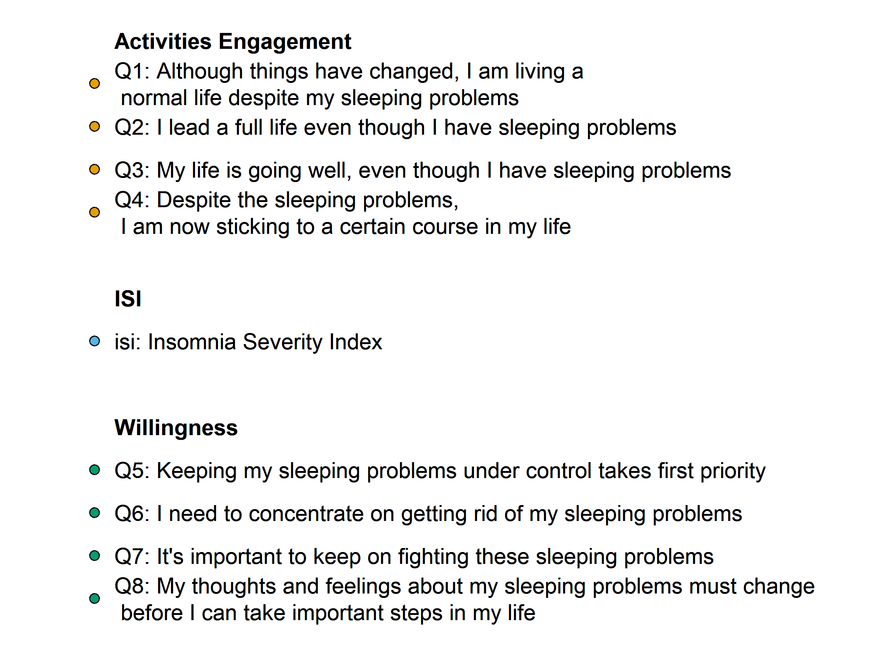

```{r, include=FALSE}
knitr::opts_chunk$set(echo = FALSE,
                      warning = FALSE,
                      tidy = FALSE,
                      message = FALSE,
                      fig.align = 'center',
                      out.width = "100%")
#options(knitr.table.format = "html") 
#options(kableExtra.html.bsTable = T)
```

```{r data, include=FALSE}
library(dplyr)
library(ggplot2)
library(bootnet)
library(qgraph)
raw_data <- readr::read_csv("G:/Documentos/ProjetosR/ASONO/act_insonia/dados/base_completa_031422.csv")

```

```{r, include=FALSE}
knitr::write_bib(c('posterdown', 'rmarkdown','pagedown'), 'packages.bib')
```

# Introduction

Theories of third-wave therapies for insomnia posits that insomnia arises from inability to disengage from information processing. Efforts of metacognitive control prevents the spontaneous processes of relaxation. Rather than controlling, management of insomnia can be made with acceptance of feelings and thoughts associated with insomnia through value-based actions. This work aims to explore which facets of acceptance are related to insomnia severity.

# Methods

Data were collected from online surveys responded by 1376 adults, aged 18 to 59 years, both with and without insomnia symptoms. Participants completed online self-report questionnaires, including, Insomnia Severity Index (ISI) and Sleep Problem Acceptance Questionnaire (SPAQ). Gaussian Graphical Models were estimated using the GLASSO regularization and EBIC model selection. We estimated a network describing the associations among each of the individual items of SPAQ and overall insomnia severity. Node centrality was assessed by strength, closeness, and betweenness. 
<br>

# Results

```{r fig1,fig.height=6, out.width="100%", dpi=300}
base_spaq <- raw_data |> 
  dplyr::filter(redcap_event_name == "elegibilidade_arm_1") |> 
  dplyr::mutate(dplyr::across(spaq_5:spaq_8, ~ 6 - .x)) |> 
  dplyr::select(igi_escore, spaq_1:spaq_8) |> 
  dplyr::rename(isi = igi_escore,
                 Q1 = spaq_1, Q2 = spaq_2,
                 Q3 = spaq_3, Q4 = spaq_4,
                 Q5 = spaq_5, Q6 = spaq_6,
                 Q7 = spaq_7, Q8 = spaq_8
)

fatores <- c("ISI", rep("Activities Engagement", 4), rep("Willingness", 4))
names <- c("ISI", paste0("Q", 1:8))
legend <- c("Insomnia Severity Index",
            "I am living a normal life despite my sleeping problems",
            "I lead a full life even though I have sleeping problems",
            "My life is going well, even though I have sleeping problems",
            "Despite the sleeping problems, I am now sticking to a certain course in my life",
            "Keeping my sleeping problems under control takes first priority",
            "I need to concentrate on getting rid of my sleeping problems",
            "It's important to keep on fighting these sleeping problems",
            "My feelings about my sleeping problems must change before I can take important steps"
            )

NetworkSPAQ <- estimateNetwork(base_spaq, default = "EBICglasso", weighted = TRUE)

plot(NetworkSPAQ, layout = "spring",
     label.scale=F, theme = "colorblind",
     nodeNames = legend, groups = fatores,
     legend.mode="style2", label.cex = 1.7,
     vsize = 12, esize = 15, details = F,legend = FALSE)

#qgraph(NetworkSPAQ$graph, layout="spring", nodeNames = legend,
#       color="seashell2", theme="colorblind", cut=0,
#       legend.cex=.32, details = F, groups = fatores)
```


```{r legend, out.width="100%", dpi=300, fig.cap = "Regularized Partial-Correlation Networks for the ISI and SPAQ items. Blue edges represent positive relations, red edges represent negative relations."}

```

```{r fig2, echo=FALSE, fig.cap='Centrality indices.', fig.height=6, out.width="100%", dpi=300}
library("qgraph")
library(ggplot2)
cplots <- centralityPlot(NetworkSPAQ, scale = c("z-scores"), 
               include = c("Strength","Closeness","Betweenness"), 
               theme_bw = TRUE, print = FALSE,
               verbose = TRUE, weighted = TRUE, 
               decreasing = T) +
  theme(strip.background = element_blank(),
        strip.text.x = element_text(size = 14),
        text = element_text(size = 14))
  
plot(cplots)
```

# Conclusion

Three items of SPAQ were particularly strong on the estimated network, namely those concerning controlling sleep problems. This may provide valuable insights to guide third-wave therapies for insomnia.
