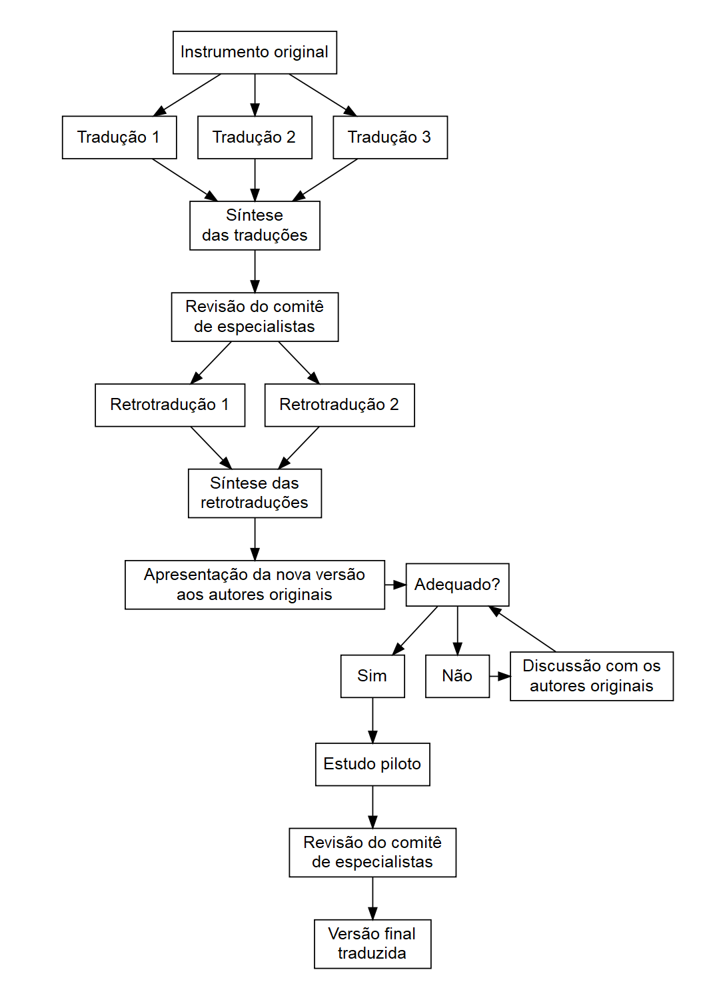

```{r setup, include=FALSE}
options(htmltools.dir.version = FALSE)
knitr::opts_chunk$set(
	echo = FALSE,
	fig.align = "center",
	fig.height = 4,
	fig.retina = 3,
	fig.width = 9,
	message = FALSE,
	warning = FALSE,
	cache = FALSE,
	hiline = TRUE,
	out.width = "100%"
)
```

```{r xaringan-themer, include=FALSE, warning=FALSE}
library(xaringanthemer)
library(xaringanExtra)
library(dplyr)
library(ggplot2)
library(kableExtra)
library(patchwork)

style_duo_accent(
  title_slide_background_color ="#FFFFFF",
  title_slide_text_color = "#024F84",
  primary_color = "#024F84",
  secondary_color = "#FF961C",
  inverse_header_color = "#FFFFFF",
  text_color = "#515151",
  text_font_size = "1.4rem",
  text_slide_number_color = "#024F84",
  table_row_even_background_color = "#D6EAF8"# "#a1c7cf",
)
```

```{r xaringan-logo, echo=FALSE}
xaringanExtra::use_logo(
  image_url = c("img/fapesp-ipq.png"),
  width = "365px",
  height = "79px",
  position = css_position(bottom = "1em", right = "1em"),
  exclude_class = c("my-title", "inverse", "hide_logo")
)
xaringanExtra::use_progress_bar(color = "#c31919", location = "top", height = "10px")
```


# Introdução

Diversos modelos cognitivos da insônia destacam a excitação cognitiva como um dos principais mantenedores do transtorno.

A Terapia Cognitivo-comportamental para a insônia (TCC-I) é um tratamento não farmacológico de eficácia comprovada. Outra alternativa terapêutica com evidências favoráveis recentes é a Terapia de Aceitação e Compromisso (ACT).

Duas ferramentas desenvolvidas para avaliar as cognições relacionadas ao sono são a **Dysfunctional Beliefs and Attitudes about Sleep Scale (DBAS)** e o **Sleep Problem Acceptance Questionnaire (SPAQ)**.

Dado que estas medidas foram desenvolvidas em um contexto cultural diferente, é necessário investigar se apresentam boas evidências de validade quando utilizadas com uma amostra brasileira.

---
# Crenças e atitudes disfuncionais sobre o sono

As crenças disfuncionais sobre o sono podem exacerbar a atividade cognitiva negativa. Em excesso, provocam excitação e angústia. Estes sentimentos podem gerar percepções distorcidas sobre o sono e superestimação das consequências da falta de sono (Harvey, 2002).

Diversos estudos identificaram que as crenças e atitudes disfuncionais sobre o sono são mediadoras da perpetuação da insônia (Akram et al., 2020; Chow et al., 2018; Harvey et al., 2017; Lancee et al., 2019)

O modelo Microanalítico de Morin (1993) sugere que insônia é mantida por um processo cíclico de excitação, pensamentos disfuncionais, hábitos desadaptativos, e consequências.

---
# Crenças e atitudes disfuncionais sobre o sono
## Relações

Indivíduos com sintomas graves de insônia tendem a endossar mais fortemente as crenças disfuncionais sobre o sono.

A gravidade da insônia, por sua vez, está associada à ansiedade e depressão.

Atribuições e expectativas irreais sobre o sono originam pensamentos geradores de ansiedade.

Além disto, individuos com altos níves de crenças disfuncionais estão mais vulneráveis à depressão em função do estilo de pensamento negativo.

---
# Crenças e atitudes disfuncionais sobre o sono
## Mensuração

Dysfunctional Beliefs and Attitudes About Sleep Scale (DBAS).

Originalmente desenvolvida em 30 itens, foi reduzida para uma versão de 16 itens que é a mais utilizada em pesquisas atuais e apresenta boas propriedades psicométricas.

Os itens são respondidos em uma escala Likert de 11 pontos, de 0 (discordo fortemente) a 10 (concordo fortemente).

Apresenta uma estrutura de 4 fatores: (a) Consequências da insônia, (b) Preocupação com o sono. (c) Expectativas sobre o sono, e (d) Medicação.


---
# Aceitação dos problemas de sono

Terapias comportamentais de terceira geração incluíram a metacognição como componente do tratamento.

Nesta perspectiva, a insônia é mantida por processos de interferência no sono e processos de interpretação do sono que se retro-alimentam.

Esforços de controle metacognitivo previnem os processos espontâneos de relaxamento.

O foco não é na eliminação das crenças disfuncionais e pensamentos negativos. A aceitação pode auxiliar na forma como o conteúdo disfuncional é interpretado, diminuindo sua interferência no sono.

---
# Aceitação dos problemas de sono
## Relações


A insônia está ligada a um forte apego às necessidades e expectativas do sono, o que alimenta a preocupação, a supressão de pensamentos e a ruminação.

A rigidez de pensamento ocasionada por inflexibilidade psicológica está associada a sintomas de depressão e ansiedade.

Espera-se que a aceitação tenha uma relação com a insônia, ansiedade e depressão semelhante ao modelo cognitivo comportamental.

---
# Aceitação dos problemas de sono
## Mensuração

O Sleep Problem Acceptance Questionnaire (SPAQ) é a única medida de aceitação dos problemas do sono publicada com eviências de validade

Examina o papel da aceitação em relação a qualidade do sono.

Possui oito itens, respondidos em uma escala de 7 pontos, de 0 (discordo) a 6 (concordo completamente).

Sua estrutura é composta por dois fatores: Engajamento em atividades e Disposição.


---
# O processo de adaptação transcultural
.v-center[


Antes de usar um instrumento psicológico existente em um contexto distinto de como foi originalmente desenvolvido, é fundamental avaliar a existência e a similaridade do construto, pois ele pode se manifestar de forma diferente.

Cinco tipos de equivalência:

1. Eqivalência conceitual;  
2. Equivalência de itens;  
3. Equivalência semântica;  
4. Equivalência operacional;  
5. Equivalência de medida.
]
---
# O processo de adaptação transcultural
## 1. Tradução dos itens

No mínimo dois tradutores independentes fluentes tanto no idioma original do instrumento quanto no idioma alvo.

Idealmente um com conhecimento do construto avaliado pela escala e outro sem familiaridade com este contexto.

Os tradutores trabalham de forma independente entre si.
---
# O processo de adaptação transcultural
## 2. Síntese das traduções

Com as traduções prontas, um comitê deve se reunir para considerar as traduções e o instrumento original de modo a produzir uma versão única.

O comitê pode ser formado pelos próprios tradutores e um terceiro juíz, ou especialistas no conceitos avaliados pela escala.

---
# O processo de adaptação transcultural
## 3. Retro-tradução

Nesta fase os autores do instrumento original são convidados a avaliar a equivalência entre a versão original e a traduzida.

A versão sintetizada é traduzida para o idioma original por, no mínimo, dois novos tradutores nativos. A mesma formação do comitê da etapa anterior pode se reunir novamente para produzir uma versão síntese da retro-tradução.

---
# O processo de adaptação transcultural
## 4. Comitê de especialistas

O grupo pode ser composto por metodologistas, profissionais da saúde, profissionais de idiomas e tradutores (retrodutores e tradutores) até agora envolvidos no processo.

Este comitê participa das etapas onde é necessário tomar decisões em relação a estrutura, layout, instruções, e a abrangência e adequação das expressões contidas nos itens.

---
# O processo de adaptação transcultural
## 5. Estudo piloto

Esta etapa pode revelar problemas não antevistos que os respondentes podem encontrar ou dificuldade de compreensão dos itens ou das instruções do teste. Os participantes também podem sugerir alterações de termos e expressões.

É uma etapa importante para avaliar se os participantes compreendem o conceito das perguntas de forma consistente e conforme pretendido pelos pesquisadores.

O pré-teste pode ser conduzido com grupos focais ou por entrevistas cognitivas individuais.

É importante que a amostra represente a diversidade que se espera encontrar no uso cotidiano do instrumento.

---
# Objetivos

a. Desenvolver uma versão em Português do Brasil das escalas Dysfunctional Beliefs and Attitudes about Sleep Scale (DBAS-16) e Sleep
Problem Acceptance Questionnaire (SPAQ);

b. Examinar sua estrutura fatorial;

c. Examinar a validade de construto.

---
# Método
## Participantes e delineamento

O tamanho amostral adequado calculado pelo teste de *close fit* de RMSEA < 0.05 com poder de 0.80 and $\alpha$ de 0.05 foi de 920 participantes.

Os critérios de inclusão foram: idade entre 18 e 59 anos e habilidade de ler e escrever em Português.

Os participantes foram recrutados por anúncios em redes sociais e divulgação entre médicos e psicólogos.

Os dados foram coletados entre Maio de 2021 e Julho de 2022, de forma *online* com auxílio do *software* REDCap. Foram incluídos participantes com e sem problemas de sono.
---
# Método
## Tradução dos itens

Os itens e instrução do teste foram traduzidos do inglês para o português por três tradutores independentes. Dois eram profissionais do sono e o terceiro, professor de inglês.

Um comitê de especialistas formado por profissionais especializados em insônia sintetizou as três traduções em uma única versão.

Dois tradutores nativos em inglês realizaram as retro-traduções, que foram novamente sintetizadas pelo mesmo comitê. A versão retro-traduzida foi enviada para apreciação dos autores do instrumento.

Após incorporar as sugestões dos autores, o instrumento foi submetido a um estudo piloto no formato de entrevistas cognitivas com 15 participantes: 12 mulheres e média de idade de 43 anos.
---
```{r diag, echo=FALSE, out.width="40%"}

```
---
# Método
## Instrumentos auxiliares

1. Índice de Gravidade da Insônia (IGI);

2. Escala Hospitalar de Ansiedade e Depressão (EHAD);

3. Acceptance and Action Questionnaire-II (AAQ-II).

---
# Método
## Plano de análise
### Estatísticas descritivas

Avaliação da variação dos itens, sua distribuição e erros de entrada.

Correlação inter-item.

Avaliação da presença de outliers multivariados pela distância de Mahalanobis para identificar padrões de resposta fora do comum.
---
# Método
## Plano de análise
### Teoria de resposta ao item Não-paramétrica (NIRT)

Mokken Scaling Analysis (MSA): possui pressupostos mais flexíveis e trata os dados como ordinais.

Investiga:

a. Unidimensionalidade;  
b. *Item step response function*: probabilidade de obter determinado escore dado o nível de traço latente;  
c. Monotonicidade;  
d. Funcionamento diferencial do item.

---
# Método
## Plano de análise
### Evidências de validade estrutural

Análise Fatorial Confirmatória (AFC) replicando o modelo original.

O ajuste do modelo será avaliado por meio dos índices: qui-quadrado $(\chi^2)$; Tucker-Lewis Index (TLI); Comparative Fit Index (CFI);  Relative Noncentrality Index (RNI); Root Mean Square Error of Approximation (RMSEA); and Standardized Root Mean Squared Residual (SRMR).

Pontos de corte: SRMR $\le$ .08, RMSEA $\le$ .06, and CFI, TLI, and RNI $\ge$ .96.

Análise Fatorial Multi-grupo (ACFMG) para investigar invariância de medida.

---
# Método
## Plano de análise
### Confiabilidade

Alfa de Cronbach $(\alpha)$, Ômega total de McDonald $(\omega_t)$, e Ômega hierárquico $(\omega_h)$.

Índices $\ge$ .70 são considerados aceitáveis.

Avaliação da consistência interna por meio de teste-reteste (14 dias): correlações fortes indicam alta confiabilidade temporal.
---
# Método
## Plano de análise
### Validade concorrente

Espera-se uma correlação positiva entre os escores da DBAS-16 com o EHAD (depressão e ansiedade) e com o IGI.

As mesmas correlações são esperadas para o SPAQ, com o acréscimo de correlação negativa com o AAQ-II.
---
# Método
## Plano de análise
### Psicometria de redes

Transtornos mentais são interpretados como uma rede causal de interações entre sintomas ao invés de uma causa única comum.

A dimensionalidade das escalas será avalida de forma exploratória por meio da *Exploratory Graph Analysis* (EGA). Este método identifica o número de comunidades e seu conteúdo dentro da rede.

Comparado a métodos tradicionais (e.g., Análise Paralela, Scree plot, etc.) a EGA apresentou maior acurácia para estimar corretamente o número de fatores, e menor erro de viés médio, em estudos de simulação.
---
# Resultados parciais

Os participantes do estudo piloto relatarm bom entendimento dos itens e instrução dos testes.

O termo "desequilíbrio químico" do item 13 da DBAS-16 foi alterado para "desequilíbrio do meu organismo".

Foi necessário adicionar uma instrução específica na SPAQ para os participantes sem problemas de sono, pedindo para que respondessem imaginando uma situação em que tiveram dificuldades para dormir.
---
# Resultados parciais

A amostra final foi composta por 1397 participantes, dos quais 1130 eram mulheres e 1062 relataram sintomas de insônia.

A média de idade da amostra foi de 38.41 anos (dp = 9.79).

619 participantes tinham emprego formal e 1085 diploma universitário.
---
# Próximas etapas

- Nov/22 - Jan/23: Análise dos dados

- Fev/23 - Mai/23: Escrita dos artigos

- Jun/23: Defesa da tese


